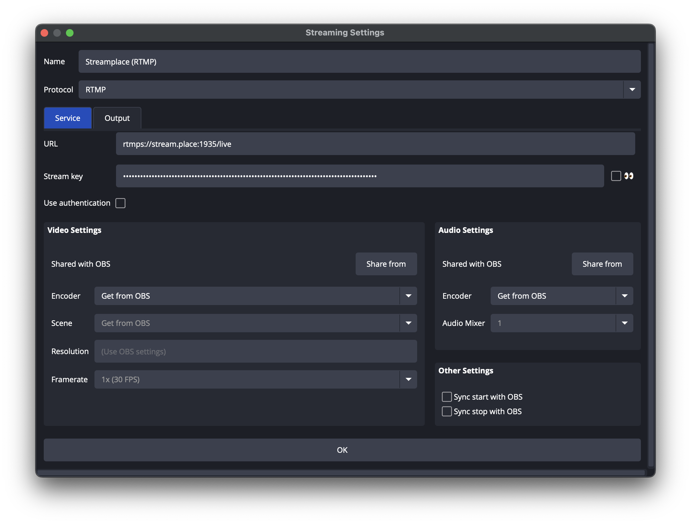

This guide explains how to configure Open Broadcaster Software (OBS) for
simultaneous streaming to Streamplace and other platforms using the
`obs-multi-rtmp` plugin.

For basic Streamplace setup with WHIP, including obtaining your stream key or
bearer token, please refer to the main
[Start streaming with OBS](/guides/start-streaming/obs) guide before proceeding
here.

### Prerequisites

To enable multistreaming, you need to install the `obs-multi-rtmp` plugin for
OBS.

- Download the latest release from:
  [GitHub Releases - obs-multi-rtmp](https://github.com/sorayuki/obs-multi-rtmp/releases)

Follow the installation instructions provided.

### Streamplace Output Configuration in `obs-multi-rtmp`

When configuring the Streamplace output within the `obs-multi-rtmp` plugin, use
the following recommended settings for optimal compatibility and audio handling
during multistreaming:

---

#### Recommended Configuration (RTMP)

- **Protocol:** RTMP
- **Server**: In live dashboard; for https://stream.place use
  `rtmps://stream.place:1935/live`
- **Audio Encoder:** _(Select an AAC encoder)_

#### Alternative Configuration (WHIP)

Streamplace also supports WHIP via this plugin. This configuration may be
suitable if you are also multistreaming to platforms like YouTube that primarily
use WHIP to avoid an audio re-encode.

- **Protocol:** WebRTC (WHIP)
- **Server**: In live dashboard; for https://stream.place use
  https://stream.place
- **Audio Encoder:** `ffmpeg_opus`

---

The image below shows where to configure these settings within the
`obs-multi-rtmp` plugin in OBS.

### Multistreaming Settings in OBS

Make sure, in your OBS settings, that you have the following settings:

- **Keyframe Interval:** `1s`
- **x264 Options:** `bframes=0`
