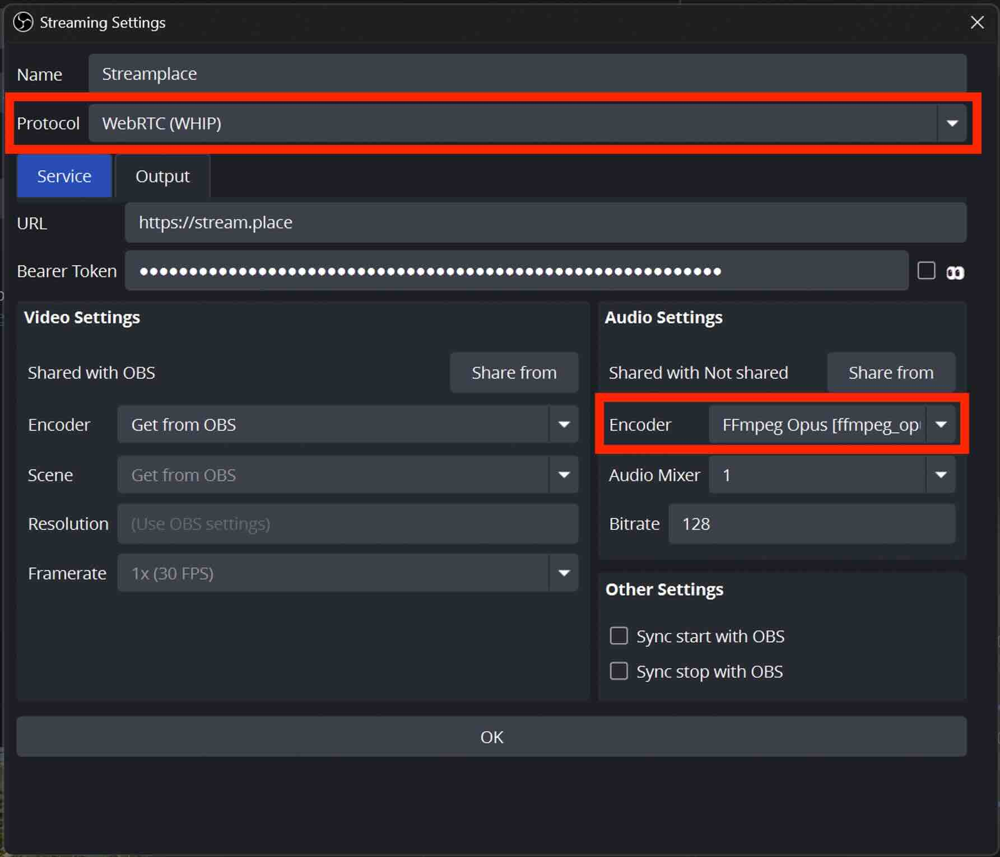

This guide explains how to configure Open Broadcaster Software (OBS) for
simultaneous streaming to Streamplace and other platforms using the
`obs-multi-rtmp` plugin.

For basic Streamplace setup with WHIP, including obtaining your stream key or
bearer token, please refer to the main
[Start streaming with OBS](/guides/start-streaming/obs) guide before proceeding
here.

### Prerequisites

To enable multistreaming, you need to install the `obs-multi-rtmp` plugin for
OBS.

- Download the latest release from:
  [GitHub Releases - obs-multi-rtmp](https://github.com/sorayuki/obs-multi-rtmp/releases)

Follow the installation instructions provided.

### Streamplace Output Configuration in `obs-multi-rtmp`

When configuring the Streamplace output within the `obs-multi-rtmp` plugin, use
the following recommended settings for optimal compatibility and audio handling
during multistreaming:

#### Recommended Configuration (WebRTC/WHIP)

Using **WHIP with `ffmpeg_opus`** is recommended for stability reasons.

- **Protocol:** WebRTC (WHIP)
- **Server**: https://stream.place
- **Audio Encoder:** `ffmpeg_opus`

#### Alternative Configuration (RTMP)

Streamplace also supports RTMP via this plugin. This configuration may be
suitable if you are also multistreaming to platforms like Twitch that primarily
use RTMP to avoid an audio re-encode.

- **Protocol:** RTMP
- **Server**: rtmps://stream.place:1935/live
- **Audio Encoder:** _(Select an AAC encoder)_

The image below illustrates where to configure these settings within the
`obs-multi-rtmp` plugin interface in OBS.

